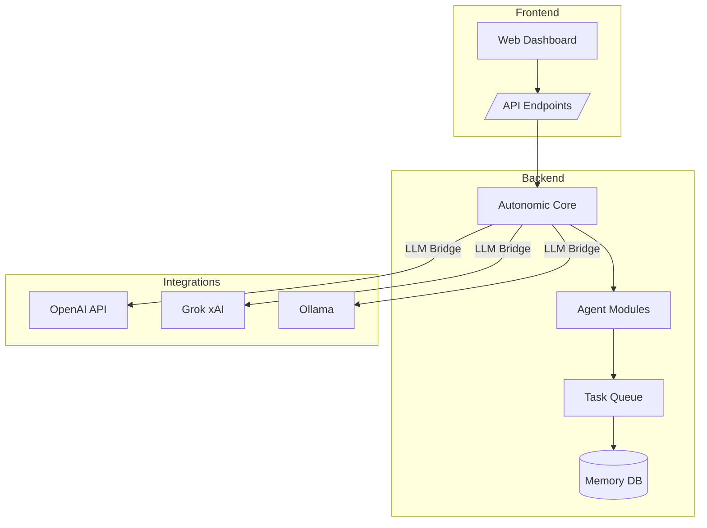

# README.md

## AI Orchestra — Autonomous Multi-LLM Development System

### Overview
AI Orchestra is a next-generation **autonomous software development system** that merges and extends the capabilities of three major open-source projects:

- **Autonomous-Agents** — modular task-based AI agents.
- **Swarms** — distributed coordination and multi-agent orchestration.
- **Atomic-Agents** — self-evolving agent logic with internal memory and reflection.

AI Orchestra unifies these into a single cohesive platform capable of **self-organizing, collaborating, debugging, and deploying** entire codebases using a team of specialized LLM-driven agents.

---

### 🧠 Core Purpose
> To create a modular AI-driven software factory — where LLMs act as developers, debuggers, and planners working together in real-time.

AI Orchestra allows developers to:
- Create and manage autonomous multi-agent workforces.
- Run concurrent development tasks across multiple LLM providers (OpenAI, xAI Grok, Ollama, etc.).
- Integrate web dashboards for real-time agent logs, project status, and LLM orchestration control.

---

### ⚙️ Core Features
- **Multi-Agent Collaboration:** Frontend, Backend, QA, Debugger, and Coordinator agents.
- **Cross-LLM Communication:** Dynamic routing between OpenAI, xAI Grok, and Ollama backends.
- **Autonomic Core:** Internal reasoning engine for task persistence and adaptive learning.
- **Distributed Task Queue:** Lightweight queue system managing agent task assignments.
- **Memory & Reflection System:** Contextual memory, reflection logs, and agent performance feedback.
- **Web Dashboard:** Real-time logs, controls, project trees, and memory visualization.
- **API Bridge:** `/api/llm_query`, `/api/task_assign`, `/api/status_stream` endpoints for front-end integration.

---

### 🏗️ Architecture Overview



---

### 🧩 Extracted & Adapted Components
| Source Repo | Key Extraction | Adapted Into |
|--------------|----------------|---------------|
| **Autonomous-Agents** | Agent role templates, task graph executor | AI Orchestra Agent Modules |
| **Swarms** | Multi-agent communication and event system | Task Queue + Event Emitter |
| **Atomic-Agents** | Reflection, reasoning, self-evolution | Autonomic Core |

---

### 🧬 Data Flow Summary
1. **Frontend** → User or LLM sends high-level objective.
2. **Core** → Decomposes into subtasks and assigns to agents.
3. **Agents** → Use provider-specific LLMs to complete code or documentation.
4. **Task Queue** → Coordinates and balances execution.
5. **Memory DB** → Stores task logs, reflection data, and final outputs.

---

### 🧱 Tech Stack
| Layer | Tools / Frameworks |
|--------|--------------------|
| Backend | Node.js (Express), Python (FastAPI optional) |
| Frontend | React + Tailwind + shadcn/ui |
| Database | SQLite / PostgreSQL for memory storage |
| Orchestration | Docker + WebSocket + EventEmitter |
| LLM Providers | OpenAI, xAI Grok, Ollama |

---

### 🚀 Implementation Roadmap
**Phase 1 – MVP (Core Build)**
- Agent classes (Frontend, Backend, QA, Debugger)
- Task queue + memory system
- Basic web dashboard + logs

**Phase 2 – Integration**
- Multi-provider LLM bridge
- API endpoints (`/api/task`, `/api/memory`, `/api/llm_query`)
- Frontend status + control panel

**Phase 3 – Reflection & Expansion**
- Agent performance scoring
- Self-rewriting capabilities
- Multi-project orchestration + CLI tools

---

### 🧩 Novel Feature: Adaptive Autonomic Core
AI Orchestra introduces a **reflection-driven feedback core** that monitors agent efficiency and rewrites agent logic dynamically — enabling self-correcting, evolving development processes.

---

## README_SCAFFOLD.md

### 🏗️ Folder Structure
```bash
AI Orchestra/
│
├── core/
│   ├── autonomic_core.js          # Central reasoning & reflection engine
│   ├── llm_bridge.js              # Multi-provider connector (OpenAI, Grok, Ollama)
│   ├── memory_manager.js          # Persistent memory + task logs
│   └── event_bus.js               # Global event emitter for agent communication
│
├── agents/
│   ├── frontend_agent.js          # Handles UI code generation & UX logic
│   ├── backend_agent.js           # Manages APIs, routes, and server logic
│   ├── qa_agent.js                # Tests, verifies, and reports issues
│   ├── debugger_agent.js          # Identifies and resolves runtime/code issues
│   └── coordinator_agent.js       # Oversees all agent interactions
│
├── api/
│   ├── index.js                   # REST endpoints (Express)
│   ├── llm_query.js               # Handles external LLM requests
│   └── task_router.js             # Distributes incoming task requests
│
├── dashboard/
│   ├── components/                # React components (cards, logs, modals)
│   ├── pages/                     # Dashboard pages (Home, Agents, Memory)
│   └── utils/                     # UI helpers, fetch wrappers
│
├── database/
│   └── memory.sqlite              # Default lightweight DB
│
├── scripts/
│   ├── quick_start.sh             # Linux/Mac setup
│   ├── quick_start.bat            # Windows setup
│   └── deploy_docker.sh           # Containerized deployment
│
├── config/
│   ├── .env.example               # Environment variable template
│   └── settings.json              # Agent & LLM config presets
│
├── tests/
│   ├── test_agents.js             # Unit tests for agent logic
│   └── integration_tests.js       # Full system checks
│
├── docs/
│   ├── ARCHITECTURE.md            # Extended architecture reference
│   ├── API_REFERENCE.md           # Endpoint documentation
│   └── PHASE_GUIDE.md             # Dev phase walkthroughs
│
├── server.js                      # Entry point – starts backend + dashboard
├── package.json                   # Node dependencies & scripts
└── README.md                      # Main system overview
```

---

### 🧩 Component Summary
| Folder | Purpose |
|---------|----------|
| **core/** | Heart of the system — reasoning, event bus, LLM routing, memory |
| **agents/** | Specialized autonomous workers for frontend/backend/QA/debug tasks |
| **api/** | Web and API interface for task routing and LLM queries |
| **dashboard/** | Web-based visualization and control panel |
| **database/** | Stores reflection logs, task metadata, memory states |
| **scripts/** | Quick setup, Docker deployment, or environment init |
| **config/** | Configuration templates and environment settings |
| **tests/** | Automated validation for agents and integrations |
| **docs/** | Extended documentation, guides, and developer notes |

---

### ⚙️ Development Notes
- Use `quick_start.bat` (Windows) or `quick_start.sh` (Unix) to launch.
- Default dashboard URL: `http://localhost:3000`
- Environment variables must be set in `.env`:
  ```bash
  OPENAI_API_KEY=sk-xxx
  GROK_API_KEY=xaixxx
  OLLAMA_ENDPOINT=http://localhost:11434
  ```

---

### 📘 Future Extensions
- CLI tool for agent orchestration
- Plugin-based agent marketplace
- AI memory visualization graph
- Autonomous project branching + merge logic

